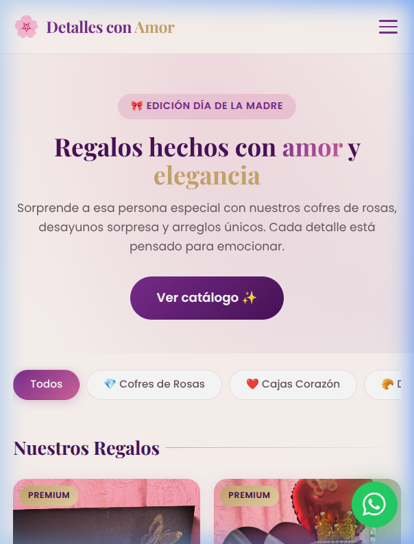
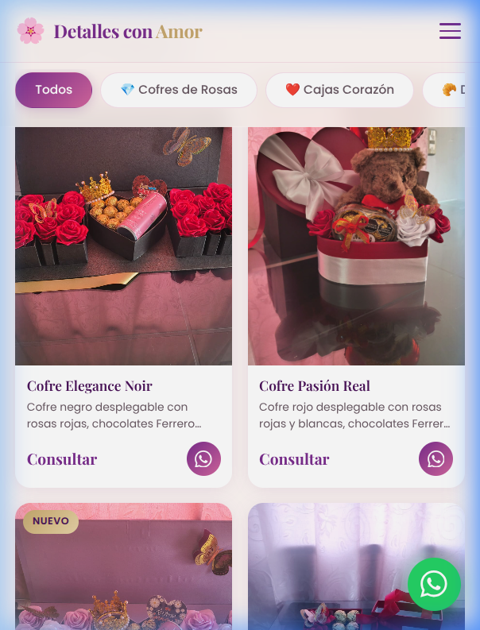
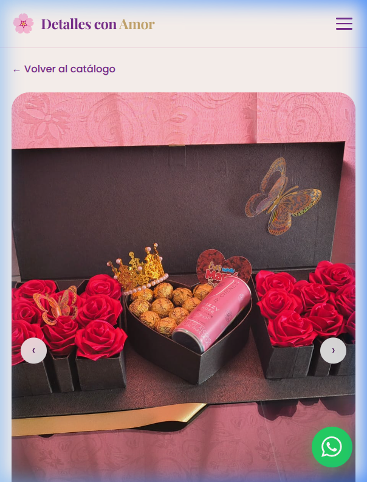
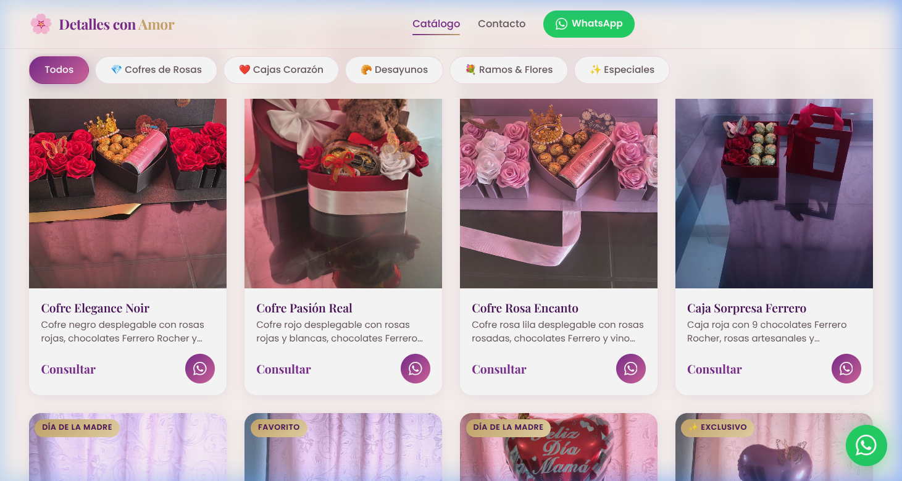

# 🌸 Detalles con Amor — Catálogo de Regalos

> Catálogo web minimalista y elegante para vender regalos artesanales para el Día de la Madre, cumpleaños y ocasiones especiales. Diseñado **mobile-first** con paleta rosa · morado · dorado.

---

## 📸 Preview

### 📱 Vista Móvil

| Hero & Filtros | Catálogo | Detalle de Producto |
|:-:|:-:|:-:|
|  |  |  |

### 🖥️ Vista Escritorio



---

## ✨ Características

- **Mobile-first** — Optimizado para celular, adaptable a escritorio
- **15 productos** en 5 categorías con galería de imágenes por producto
- **Filtros por categoría** — Cofres de Rosas, Cajas Corazón, Desayunos, Ramos & Flores, Especiales
- **Galería con swipe táctil** en la vista de detalle de producto
- **Botón WhatsApp integrado** — Mensaje pre-escrito al hacer clic en cualquier producto
- **Botón flotante WhatsApp** — Accesible desde cualquier página
- **Glassmorphism header** — Sticky con blur backdrop
- **Animaciones suaves** — Fade-in al scroll y hover effects en cards
- **Sin dependencias** — HTML, CSS y JS vanilla puro

---

## 🗂️ Estructura del Proyecto

```
catalogo-mom/
│
├── index.html              # Página principal (catálogo)
│
├── css/
│   └── styles.css          # Design system completo (variables, componentes, responsive)
│
├── js/
│   └── app.js              # Datos de productos, renderizado, galería, WhatsApp
│
├── template/
│   └── producto.html       # Página de detalle de producto (dinámica)
│
├── img/
│   ├── cofre-negro-1.jpeg
│   ├── cofre-rojo-1.jpeg
│   ├── corazon-oso-1.jpeg
│   └── ...                 # 37 imágenes de productos
│
└── screenshots/            # Capturas para este README
```

---

## 🛍️ Productos del Catálogo

| Categoría | Productos |
|-----------|-----------|
| 💎 **Cofres de Rosas** | Cofre Elegance Noir, Cofre Pasión Real, Cofre Rosa Encanto, Caja Sorpresa Ferrero |
| ❤️ **Cajas Corazón** | Corazón con Oso de Peluche |
| 🥐 **Desayunos** | Bandeja Desayuno "Te Amo", Cajón Feliz Cumpleaños, Caja Desayuno Deluxe Rosa, Bandeja Feliz Día con Torta |
| 💐 **Ramos & Flores** | Ramo Royal Burgundy, Canasta Corazón Floral |
| ✨ **Especiales** | Cajita Feliz Día Mamá, Arreglo Día de la Madre, Set Victoria's Secret, Bandeja Spa Relax |

---

## 🎨 Design System

| Token | Valor | Uso |
|-------|-------|-----|
| `--rosa-pastel` | `#f2d0de` | Fondos suaves, badges |
| `--rosa-medio` | `#e8a0bf` | Bordes, acentos |
| `--morado` | `#7b2d8e` | Color principal, botones |
| `--morado-oscuro` | `#4a1259` | Footer, títulos |
| `--dorado` | `#c9a96e` | Badges premium, acentos |
| `--crema` | `#fff8f5` | Fondo del body |

**Tipografía:** [Playfair Display](https://fonts.google.com/specimen/Playfair+Display) (títulos) + [Poppins](https://fonts.google.com/specimen/Poppins) (cuerpo)

---

## 🚀 Uso Local

```bash
# Clonar o descargar el repositorio
cd catalogo-mom

# Iniciar servidor local (Python)
python3 -m http.server 8080

# Abrir en el navegador
# http://localhost:8080
```

> ⚠️ Debe abrirse desde un servidor HTTP (no directamente como archivo) para que el JS funcione correctamente.

---

## 📲 Configuración de WhatsApp

El número de WhatsApp se configura en una sola línea de `js/app.js`:

```js
const WHATSAPP_NUMBER = '573105216032';
```

Cada botón de producto genera un mensaje pre-escrito automáticamente:
> *"¡Hola! 🌸 Estoy interesad@ en el producto "Cofre Elegance Noir" del catálogo. ¿Me podrías dar más información sobre disponibilidad y precio? ¡Gracias! ✨"*

---

## 💰 Agregar Precios

Los precios se editan en el array `PRODUCTS` dentro de `js/app.js`. Cambiar `'Consultar'` por el precio real:

```js
{
  id: 'cofre-negro',
  name: 'Cofre Elegance Noir',
  price: '$180.000',   // ← Editar aquí
  ...
}
```

---

## 📱 Responsive Breakpoints

| Breakpoint | Columnas grid | Comportamiento nav |
|-----------|--------------|-------------------|
| `< 768px` | 2 columnas | Hamburger menu con botón ✕ |
| `≥ 768px` | 3 columnas | Nav horizontal |
| `≥ 1024px` | 4 columnas | Nav horizontal completo |

---

## 🛠️ Tecnologías

- 
- 
- 

Sin frameworks, sin dependencias, sin build tools. 100% vanilla.

---

<p align="center">Hecho con 🌸 y mucho amor</p>
